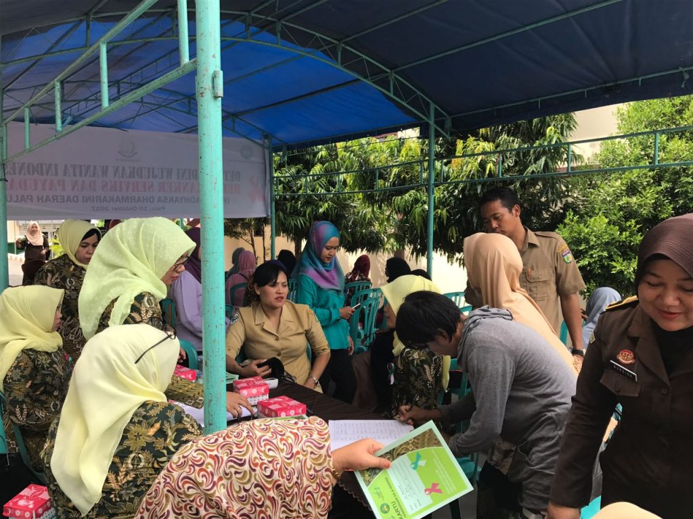

**Palu -**Terus meningkatnya angka penyakit Kanker leher rahim, dan Kanker Payudara di wilayah Kota Palu membuat Ikatan Adhyaksa Dharmakarini (IAD) Daerah Palu melakukan kegiatan nasional dengan mendatangkan ratusan perempuan untuk mengikuti deteksi dini dua penyakit pembunuh perempuan itu di Kantor Kejaksaan Negeri (Kejari) Palu, Selasa (10/10) kemarin. Kepala Dinas Kesehatan Kota Palu dr Royke Abraham mengatakan kegiatan nasional, dalam melakukan deteksi dini kanker leher rahim dan pemeriksaan payudara klinis, dan tes inspeksi visual dengan asam asetat (IVA). Kegiatan ini tentunya sangat penting karena kejadian saat ini kanker leher mulut rahim ini, seperti juga kanker payudara adalah salah satu pembunuh, dan masuk kategori tertinggi dalam penyakit kanker, "katanya disela-sela acara tersebut. Kata dia, sangat berbahaya apabila di salah satu rumah tangga sudah terserang penyakit ini melalui ibu rumah tangga. Itulah yang perlu dicegah sejak dini. " Pemeriksaan ini ada tanda apabila menuju ke penyakit itu, ada tanda pada mulut rahim pada stadium satu dan dua, maka kami segera melakukan tindakan, " Tegasnya. Namun, apabila sudah stadium lanjut, maka kanker tersebut sudah menyebar dan langkah pengobatannya sudah berbeda."atrinya tidak bisa lagi kita pertahanan nyebar," ungkapnya.

\[caption id="attachment\_798" align="aligncenter" width="640"\] pemeriksaan kanker serviks dan payudara\[/caption\]

Ada cara lain untuk melakukan pencegahan, kata Royke, Dinas Kesehatan melakukan penyuluhan bagaimana harus menjaga agar tidak ada penularan virus Human Papillomavirus (HPV) kepada perempuan khususnya yang sudah berumah tangga. "Tentunya untuk perempuan bagaimana bisa menjaga kebersihan pada organ kewanitaan, dan kepada yang sudah menikah diharapkan untuk tidak mengganti pasangan, atau melakukan hubungan seks yang aman. Itulah yang diharapkan Dinas Kesehatan agar tidak menyebarnya virus tersebut, "harapnya. Royke menjelaskan, untuk total kanker mulut rahim hingga saat ini terus meningkat. " Kami belum bisa sebutkan data pastinya, intinya dari bulan ke bulan terus mengalami peningkatan dalam penyakit ini, " jelasnya. Sementara Kajari Palu Subeno menyatakan bahwa, kegiatan yang diselenggarakan oleh IAD Daerah Palu adalah kegiatan nasional yang diinstruksikan langsung oleh Presiden RI Joko Widodo. " Kami berharap kegiatan ini akan berdampak positif kepada perempuan Kota Palu sesuai tema yang kami angkat yaitu Deteksi dini wujudkan wanita indonesia bebas dari kanker serviks dan payudara. " Katanya.

_Sumber : Harian Radar Sulteng, Rabu 11 Oktober 2017._
