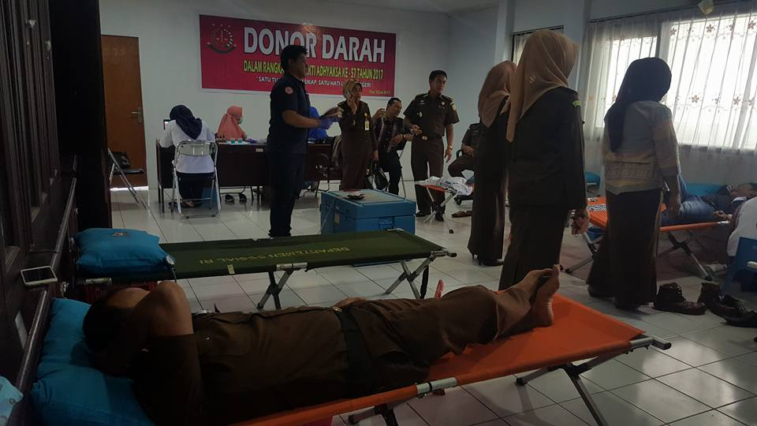

**Palu -**Peringatan Hari Bhakti Adhyaksa (HBA) ke-57, Kejaksaan Negeri (Kejari) Palu yang diadakan berpusat di Kejaksaan Tinggi Sulteng, menyelenggarakan berbagai kegiatan salah satunya jalan santai bersama dan donor darah. Jalan santai sendiri di adakan pada hari Minggu 16 Juli 2017 sedangkan Donor Darah di adakan pada Selasa 18 Juli 2017.

Kegiatan donor darah ini sendiri rutin diadakan setiap pelaksanaan HBA ini diharapkan dapat menambah ketersedian kantong darah di PMI Palu, kegiatan ini tentu sangat bermanfaat bagi masyarakat. Sedangkan untuk jalan sehat yang dimulai pukul 06.30 WITA ini dilepas langsung oleh Kepala Kejaksaan Tinggi Sulteng Sampe Tuah, SH serta diikuti oleh seluruh pegawai Kejati Suteng, Kejari Palu, Kejari Donggala, Kejari Moutong dan Poso, yang dilanjutkan dengan undian doorprice. (ucp)
