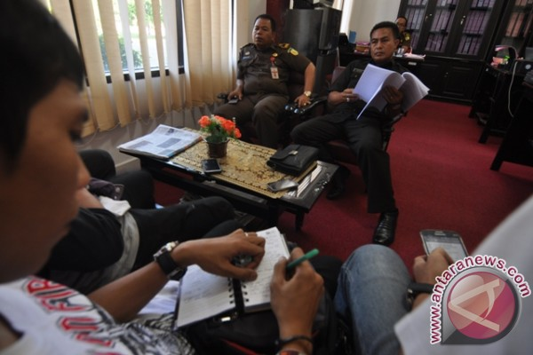

Palu (antarasulteng.com) - Kejaksaan Negeri (Kejari) Palu menetapkan dua tersangka dalam pengusutan kasus dugaan korupsi dana hibah kepada Komite Olahraga Nasional (KONI) Kota Palu tahun 2014-2015 sekitar Rp2,7 miliar. Kedua tersangka yakni berinisial DG dan KA, jelas Kepala Kejari Palu melalui Kasi Pidsus, Efrivel yang saat itu didampingi Kasi Datun, Sudiarta kepada wartawan, Senin (31/7). DG merupakan ketua harian dan KA selaku bendahara pada KONI Kota Palu saat itu. Meski telah ditetapkan sebagai tersangka, hingga saat ini keduanya belum ditahan oleh penyidik. Penahanan belum dilakukan sebab kedua tersangka masih bersikap kooperatif dan juga masih terdapat sejumlah dokumen atau data yang dibutuhkan penyidik dari keduanya. "Keduanya akan kembali diperiksa pada pekan depan," tambah Efrivel. Diterangkan Efrivel, kasus itu bermula ketika KONI mendapatkan kucuran dana hibah yang bersumber dari APBD Kota Palu pada 2014 sejumlah Rp2,7 miliar yang dicairkan dalam dua tahap. Pada tahap pertama sekitar Rp700 juta dan tahap kedua Rp2 miliar. Dana hibah itu dikucurkan KONI Palu untuk digunakan mengikuti Popda Sulawesi Tengah di Kabupaten Banggai dan Porprov di Kabupaten Poso. Namun, dari penggunaan total dana itu sekitar Rp837 juta tidak dapat dipertanggung jawabkan oleh KONI, terangnya. Dilanjutkan Efrivel, saat ini proses penyidikan kasus itu masih berlanjut dan tidak menutup kemungkinan akan ada tersangka lainnya. "Kemungkinan tersangka baru tetap ada mengingat proses penyidikan masih berjalan, kita lihat saja perkembangan penyidikan," kata Efrivel. Sementara, dalam kasus itu kedua tersangka disangkakan melakukan tindak pidana sebagaimana diatur dan diancam dalam Pasal 2 dan Pasal 3 Undang-undang Nomor 31 tahun 1999 tentang Pemberantasan Tindak Pidana Korupsi sebagaimana telah diubah dan ditambah dengan Undang-undang Nomor 20 tahun 2001 tentang Pemberantasan Tindak Pidana Korupsi.\*\*\*

\[caption id="" align="alignnone" width="600"\] Kasi Pidsus Kejaksaan Negeri Palu, Efrivel (kiri) didampingi Kasi Datun, Sudiarta saat memberikan keterangan pers, Senin (31/7), terkait dugaan korupsi di KONI Palu. ( (ANTARASulteng/Mohamad Hamzah))\[/caption\]

sumber :[http://sulteng.antaranews.com](http://sulteng.antaranews.com/berita/33827/kejari-tetapkan-dua-tersangka-di-koni-palu)
