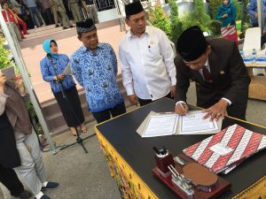

**Palu -**Kejaksaan Negeri Palu yang diwakili oleh Kepala Seksi Perdata dan Tata Usaha Negara (Datun) I Ketut Sudiarta menanda tangani MoU / Nota Kesepahaman Bersama dengan Pemerintah Kota Palu diantaranya dengan Walikota Palu, Rumah Sakit Umum Anutapura Palu, Dinas Pendidikan dan Kebudayaan Kota Palu dan Badan Pendapatan Kota Palu. Acara penadatanganan MoU tersebut merupakan rangkaian dari acara pelatikan Pejabat di Lingkungan Pemkot Palu.

Maksud dan Tujuan dilakukan Mou ini adalah untuk memaksimalkan peran dan fungsi Kejaksaan dalam sistem hukum di bidang Perdata dan Tata Usaha Negara yang meliputi bantuan Hukum, Pertimbangan Hukum dan Tindakan Hukum Lain sebagaimana Tugas dan wewenang Kejaksaan Republik Indonesia sesuai dengan Pasal 30 ayat (2) Undang-undang Nomor 16 Tahun 2004 tentang Kejaksaan RI yaitu "**di bidang Perdata dan Tata Usaha Negara, Kejaksaan dengan kuasa khusus dapat bertindak di dalam maupun diluar pengadilan untuk dan atas nama Negara atau Pemerintah"**, dalam hal ini Kejaksaan bertindak dalam kapasitas sebagai **Jaksa Pengacara Negara**.

\[caption id="attachment\_444" align="aligncenter" width="377"\] Walikota Palu Hidayat mendanda tangani MoU dengan Kejari Palu\[/caption\]

Turut hadir dalam acara tersebut Walikota Palu, Wakil Walikota Palu, Kapolres Palu, Dandim 1306 Donggala/Palu dan unsur pejabat di lingkungan Pemerintahan Kota Palu. (ucp)
