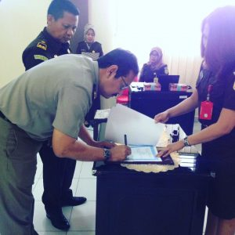

**Palu -** Kepala Kantor Pertanahan Kota Palu dan Kepala Kejaksaan Negeri Palu Kamis, (16/3/17) pukul 10:00 WITA melaksanakan Penandatanganan Kesepakatan Bersama / MoU tentang penanganan masalah hukum Perdata dan Tata Usaha Negara bertempat di aula Kejaksaan Negeri Palu. Kegiatan ini diikuti oleh para Kasi, Kasubag, pegawai di lingkungan Kejari Palu dan Para Kasi, Kaur di lingkungan Kantor Pertanahan Kota Palu. Penandatanganan dilakukan oleh Kepala Kantor Pertanahan Kota Palu Ery Suwondo, S.H. dan Kepala Kejaksaan Negeri Palu yang diwakili oleh Kasi Pidum Surianto,S.H., karena Kajari Palu Subeno,S.H. pada saat yang bersamaan menghadiri undangan Sesjampidsus Di Kejaksaan Agung R.I. di Jakarta.

\[caption id="attachment\_540" align="alignright" width="300"\] Kepala Kantor Pertanahan Kota Palu Ery Suwondo, S.H. Menandatangani Kesepakatan bersama dengan Kejari Palu\[/caption\]

Penandatanganan piagam kerjasama ini merupakan langkah nyata dalam upaya peningkatan fungsi dan peran 2 instansi pemerintah didalam meningkatkan kontribusi bagi pembangunan nasional khususnya Kota Palu sesuai peranan masing-masing.

Kejaksaan RI berdasarkan UU no.16 tahun 2004 tentang Kejaksaan mempunyai tugas dan wewenang dibidang Hukum Perdata dan Tata Usaha Negara meliputi Penegakan Hukum, Bantuan Hukum, Pertimbangan Hukum, Pelayanan Hukum dan Tindakan Hukum Lainnya. "Diharapkan nanti kedepannya Instansi-instansi pemerintah maupun BUMN dan BUMD dapat memanfaatkan peran dan fungsi Kejaksaan dibidang Perdata dan Tata Usaha Negara" ujar Kasi Datun I Ketut Sudiarta.(ucp)
