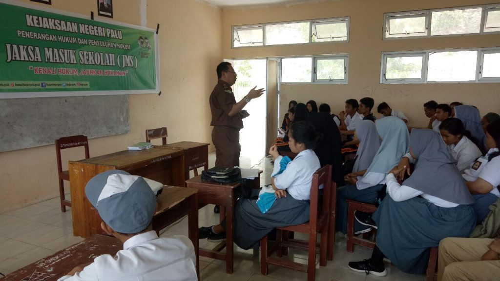

**Palu -** Tim Jaksa Masuk Sekolah (JMS) Kejari Palu sambangi SMKN 8 Palu (8/5/2018) dalam rangka melaksanakan kegiatan yang menjadi salah satu program Kejaksaan dalam rangka penanaman sejak dini kesadaran hukum pada pelajar. Dipilihnya SMKN 8 Palu karena kegiatan seperti ini baru pertama kali diadakan pada sekolah tersebut.

"Diharapkan anak-anak murid sekalian dapat mengambil pelajaran dari kegiatan ini, dan dapat memanfaatkan kegiatan untuk bertanya seputar hukum yang ada" ujar Kepala Sekolah SMKN 8 Palu, Drs. Djalal M.Pd. saat membuka acara tersebut.

Dalam kegiatan JMS kali ini pemateri Taufan, SH. jaksa pada Kejaksaan Negeri Palu, menyampaikan materi dengan sistem 2 arah, sehingga siswa lebih antusias dalam memberikan pertanyaan.

Diakhir sesi tim JMS membagikan souvenir kepada siswa-siswi yang mampu menjawab pertanyaan yang diajukan oleh pemateri. (ucp)
