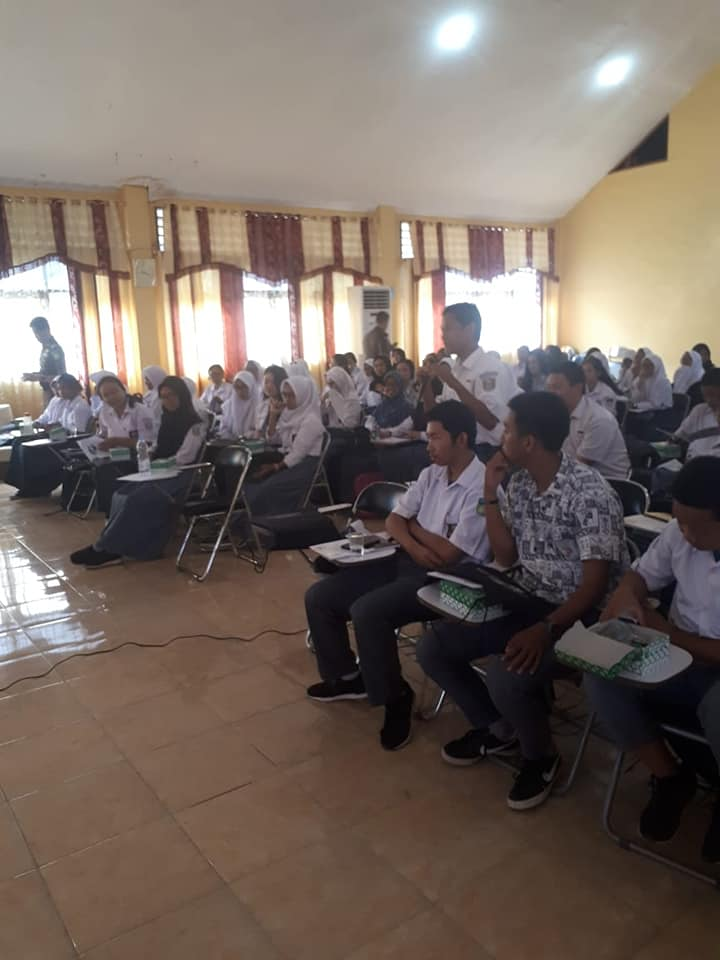
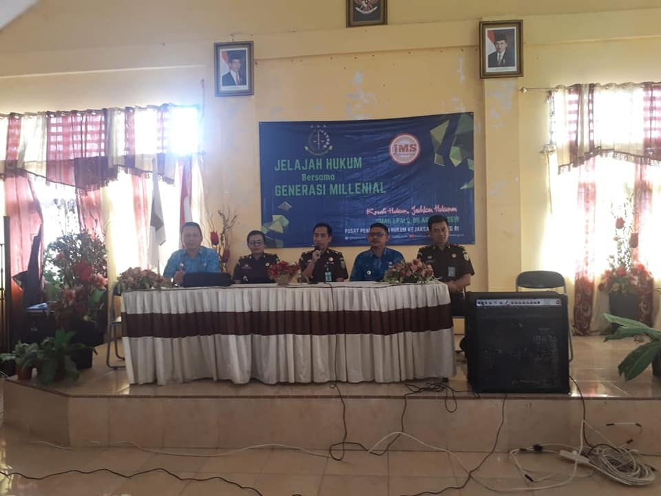
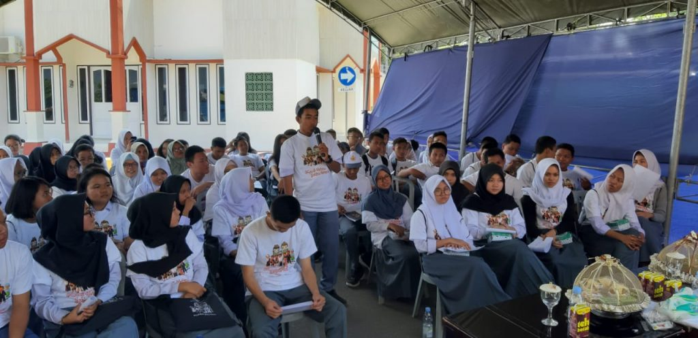
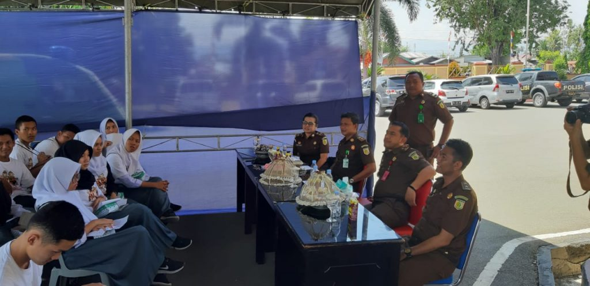

Pada Hari Kamis tanggal 8 Agustus 2019 Tim Penerangan Hukum dan Penyuluhan Hukum Pada Pusat Penerangan Hukum Kejaksaan Agung RI melalui program JMS yang diketuai oleh Ibu Marshel Julia Simbiak, SH.MH, bersama Tim Kejati Sulteng serta Tim Kejari Palu menyelenggarakan Kegiatan Penerangan Hukum / Penyuluhan Hukum Program Jaksa Masuk Sekolah yang bertempat di SMAN 1 Palu dan di Kantor Kejaksaan Negeri Palu serta diikuti ± 80 m Siswa , dengan tagline "Kenali Hukum Jauhkan Hukuman".

Kegiatan ini dilaksanakan dalam rangka penengenalan dini tentang hukum yang berlaku di Indonesia. Kegiatan ini berlangsung secara interaktif, serta melibatkan audiens dalam hal ini para siswa siswi SMAN 1 Palu, dalam hal tanya jawab dengan pemateri.(ucp)

   
