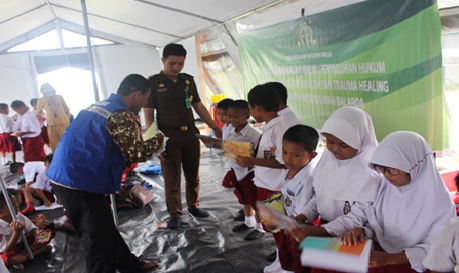
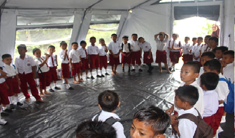
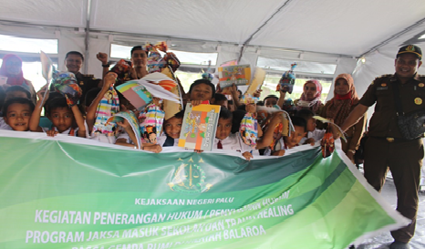

**Palu -** Sekitar 100 anak korban korban gempa bumi, tsunami, dan likuefaksi di Kota Palu, Sulawesi Tengah, mengikuti kegiatan trauma healing. Kegiatan yang digelar di tenda Sekolah Sementara SDN Inpres Balaroa, Palu, pada 21 Januari 2019, meliputi pemberian games dan hadiah yang digelar oleh Kejaksaan Negeri Palu bekerja sama dengan Dinas Sosial Kota Palu.

\[caption id="attachment\_974" align="aligncenter" width="459"\] Trauma Healing Kejari Palu\[/caption\]

"Anak-anak butuh yang seperti ini, karena secara psikis, mereka terganggu. Dengan kegiatan ini, mereka bisa jadi lebih fun dan orang tua juga bisa lebih senang," kata salah satu guru di SD Inpres Balaroa.

\[caption id="attachment\_975" align="aligncenter" width="459"\] Trauma Healing\[/caption\]

Gempa bumi berkekuatan 7,4 skala Richter yang mengguncang Kota Palu, Donggala, dan Sigi, pada 28 September 2018, dua ribuan orang meninggal, ribuan orang mengalami luka-luka serta ribuan rumah dan bangunan rusak.

Selain memberikan trauma healing, Kejaksaan Negeri Palu juga membagikan hadiah kepada para siswa.(tim redaksi)

\[caption id="attachment\_976" align="aligncenter" width="466"\] Trauma Healing\[/caption\]
