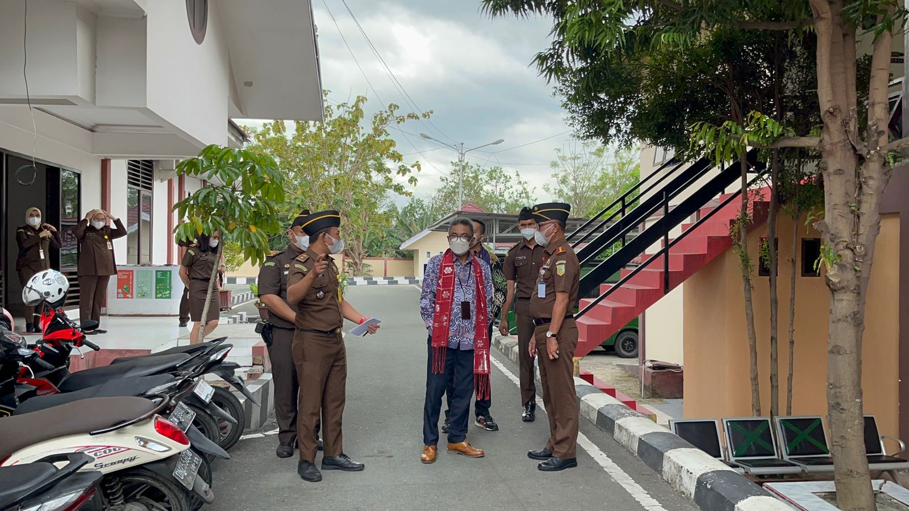

**Palu -** Kunjungan Tim Evaluator Kementerian Pendayagunaan Aparatur Negara Reformasi Birokrasi (Kemenpan RB) di Kejaksaan Negeri Palu, Senin (06/12/2021), dalam rangka Verifikasi Lapangan Pembangunan Zona Integritas (ZI) menuju Wilayah Bebas dari Korupsi (WBK) pada Kejaksaan Negeri Palu. Tim disambut langsung oleh Kajari Palu Hartawi, S.H., Para Kasi, Kasubagbin, dan seluruh pegawai Kejaksaan Negeri Palu.

Dalam kunjungannya Tim dari Kemenpan RB melalukan pemantauan dan penilaian langsung tentang layanan PTSP dan kecakapan petugasnya, agen perubahan, ruang publik, media informasi, dan inovasi khususnya dalam hal pencegahan korupsi dan peningkatan kualitas pelayanan publik. (ucp)
