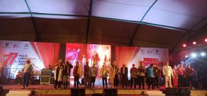

Palu - Kepala Kejaksaan Negeri Palu, Hartawi.SH., menghadiri Kegiatan Festival Kebangsaan Dalam Rangka Bulan Pancasila dan Menyemarakkan HUT RI Ke-77 Tahun 2022 yang diadakan di Taman GOR Kota Palu, Senin (08/08).

Festival ini menghadirkan berbagai rangkaian seperti workshop video musik kebangsaan, bedah karya musik kebangsaan, lomba video pendek dan konten kreatif, lomba paduan suara lagu Indonesia Raya tiga stanza dan mars BNN. Ada pula parade seni anak bangsa, parade budaya nusantara, launching lagu Palu Adipura, dan launching video musik kebangsaan yang berlangsung sejak 03 Agustus hingga malam puncak. Dan juga menghadirkan tiga bintang tamu, Ketiga bintang tamu Festival Kebangsaan Kota Palu adalah Gilang Ramadhan, Cindi Gulla dan Ngatawi Al-Zastrow.

Kegiatan ini merupakan hasil kolaborasi Pemerintah Kota Palu, Badan Narkotika Nasional Kota (BNNK) Palu dan Badan Pembinaan Ideologi Pancasila.
