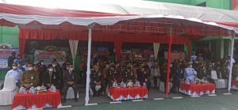
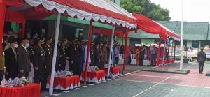

**Palu -** Upacara peringatan HUT TNI Ke - 77 dilaksanakan di Lapangan Makorem 132/Tadulako bersama Forkopimda Prov. Sulawesi Tengah dan Forkopimda Kota Palu, (05/10/22).

Yang bertindak selaku Inspektur Upacara Komandan Korem 132/Tdl Brigjen Toto Nurwanto, S.I.P., M.Si., Serta Komandan Upacara Mayor Chk Stevanus Piay, S.H., memimpin Upacara dalam rangka HUT TNI ke-77 Tahun 2022.

Turut Hadir dalam Kegiatan tersebut Gubernur yang diwakili Wakil Gubernur Prov.Sulteng, Kapolda Sulteng yang Diwakili Wakapolda Sulteng, Kabinda Sulteng, Kajati Sulteng, DPRD Sulteng, Danlanal Palu, Dansatbrimob Sulteng, Dandim 1306/KP, Para Kasi Korem 132/Tdl, Danden AU Palu, Serta Unsur Forkopimda
