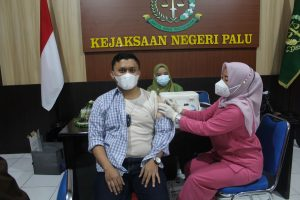
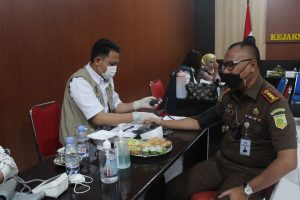

**Palu** - Guna melindungi kerja aparat penegak hukum dari bahaya terpapar Covid 19, Kejaksaan Negeri Palu, Rabu, (26/1/2022) menggelar vaksinasi booster atau dosis lanjutan.

Hal ini didasari hasil studi yang menunjukkan telah terjadi penurunan antibodi pada 6 bulan setelah mendapatkan vaksinasi COVID-19 dosis primer lengkap, sehingga dibutuhkan pemberian dosis lanjutan atau booster untuk meningkatkan proteksi individu terutama pada kelompok masyarakat rentan.

Kepala Kejaksaan Negeri Palu, Hartawi SH usai divaksin kepada RRI. CO.ID menjelaskan bahwa pihaknya telah berkordinasi dengan Satgas Penanganan Covid 19 Provinsi Sulawesi Tengah untuk menggelar kegiatan vaksinasi booster.

“Setelah melakukan koordinasi dengan Satgas Covid 19 Provinsi Sulawesi Tengah, kami difasilitasi untuk vaksin booster bagi seluruh pegawai Kajari Palu. Sebelumnya dengan satgas pemkot Palu, hanya saja mereka masih focus kepada vaksinasi anak dan lansia”. Ujar Hartawi.

Kajari Palu, Hartawi menjelaskan bahwa pihaknya merasa perlu vakskinasi lanjutan karena aparat penegak hukum seringkali bersentuhan langsung dengan orang banyak  dalam kegiatan persidangan, pelayanan maupun pendampingan hukum.

“Aparat kami baik Jaksa maupun yang lainnya senantiasa berhadapan langsung dengan public. Baik untuk pendampingan dan pelayan hukum, mengikuti persidangan bahlan bertatap muka dengan narapidana, serta kegiatan lainnya yang tentu rentan terpapar Covid 19 apalagi ini tengah marak varian Omicron. Jadi untuk memberikan perlindungan lebih baik lagi “. Ujar Kajari Hartawi.

Palu juga menegaskan bahwa masyarakat tidak perlu terpengaruh dengan berita hoax terkait vaksinasi, karena pemerintah bermaksud untuk mewujudkan kekebalan kelompok yang llebih baik lagi sehinga secara bertahap dapat pulih kegiatan kemasyarakatan dan pemerintahan.

 

sumber : [rri.co.id](https://rri.co.id/palu/daerah/1338856/kejari-palu-gelar-vaksinasi-booster?utm_source=news_main&utm_medium=internal_link&utm_campaign=General%20Campaign)
