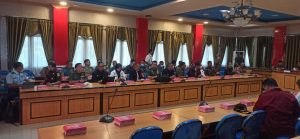

Palu - Kepala Kejaksaan Negeri Palu, Hartawi,SH., menghadiri kunjungan Lembaga Ketahanan Nasional Republik Indonesia (Lemhanas RI) pada Rabu, 06 Juli 2022 di Ruang rapat Bantaya Kantor Wali Kota Palu

Kegiatan tersebut merupakan kunjungan Studi Strategis Dalam Negeri dari para peserta Program Pendidikan Reguler Angkatan (PPRA) XLIV Lemhannas RI tahun 2022 ke Pemerintah Kota Palu.

Sumber: Bagian PROKOPIM Setda Kota Palu
