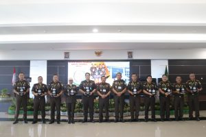
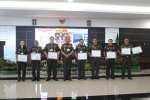
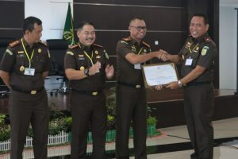

Palu - Telah dilaksanakan Rapat Kerja Daerah selama 2 (dua) hari Yaitu Hari Rabu-Kamis (21-22 Desember 2022) di Kantor Kejaksaan Tinggi Sulawesi Tengah. Dalam pelaksanaan Rapat Kerja Daerah Kejaksaan Tinggi Sulawesi Tengah, Hari Kamis, Tanggal 22 Desember 2022, Kepala Kejaksaan Negeri Palu, Bapak Hartawi, S.H., menerima tiga Penghargaan sekaligus dalam Rangkaian Kegiatan Rapat Kerja Daerah (RAKERDA) Kejaksaan Tinggi Sulawesi Tengah Tahun 2022.  Piagam Penghargaan yang diterima antara lain : 1. Kinerja Tindak Pidana Umum Terbaik Ke-1, 2. Pelaksanaan Restorative Justice (RJ) Terbaik Ke-1, dan 3. Kinerja Bidang Intelijen Terbaik Ke-1

