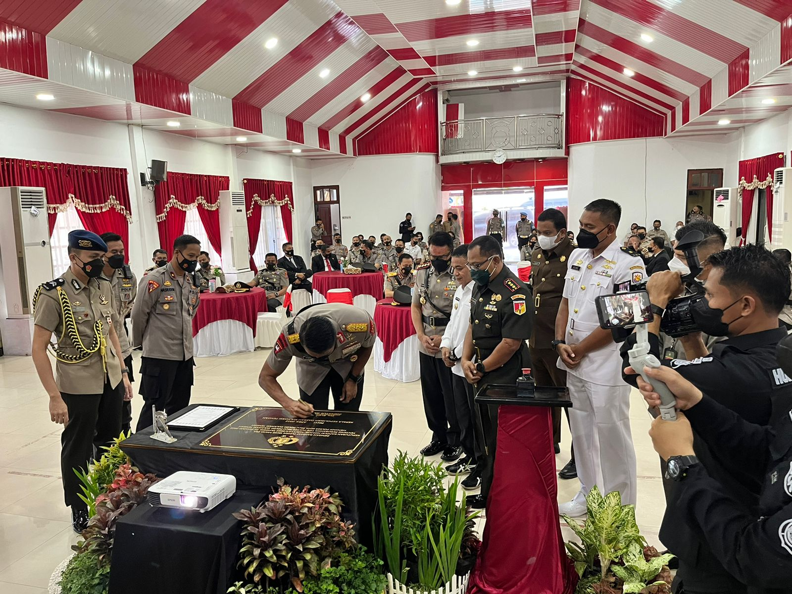

**Palu -** Kepala Kejaksaan Negeri Palu yang diwakili oleh Bapak Sugandhi,SH menghadiri Undangan Pengukuhan Kenaikan Tipe Polres palu menjadi Polresta Palu, Sekaligus Penandatanganan Berita Acara dan Penandatanganan Prasasti yang Berlangsung di Gedung Totabelo Polres Palu

Dipimpin langsung oleh Kapolda Sulteng lrjen Pol.Drs Rudy Supahriadi didampingi Oleh Wakapolda Brigjen. Pol. Hery Santoso, S.I.K., M.H. Kapolresta Palu Kombes Pol Barliansyah ,S.I.K.M.H Pju Polda Sulteng dan Para Forkopimda kota Palu serta Pejabat Utama Poltesta Palu

Polresta Palu tersebut dikukuhkan oleh Kapolda Sulteng, Irjen Pol Rudi Sjufahriadi setelah melantik Kombes Pol Barliansyah sebagai Kapolresta Palu.
