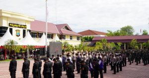

Palu - Kepala Kejaksaan Negeri Palu, Hartawi,SH pada Selasa, 05 Juli 2022 secara virtual dari Markas Polresta Kota Palu. Upacara tersebut dipimpin langsung oleh Presiden RI, Ir. Joko Widodo yang dipusatkan di Kampus Akademi Kepolisian, kawasan Candi, Semarang, Jawa Tengah

Turut hadir di Markas Polresta Palu tersebut yakni Kapolresta Kota Palu, Kombes Polisi Barliansyah, Dandim 1306 Kota Palu, Letkol Inf. Ari Suseno, S.Sos, dan unsur Forkopimda Kota Palu lainnya

 

Sumber : Bagian PROKOPIM Setda Kota Palu
