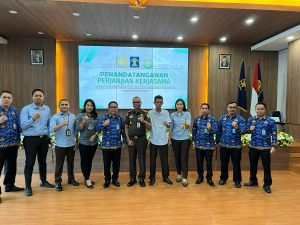

Palu - telah dilaksanakan penandatanganan Kesepakatan Bersama antara Kantor Imigrasi Kelas 1 TPI Palu dengan Kejaksaan Negeri Palu tentang bantuan hukum, pertimbangan hukum dan tindakan hukum lainnya di bidang perdata dan tata usaha negara, pada hari kamis, 10 November 2022. Penandatanganan ini dilakukan oleh Kepala Kantor Imigrasi Kelas 1 TPI Palu bapak Dewanto Wisnu Raharjo, S.H. dan Kepala Kejaksaan Negeri Palu bapak Hartawi, S.H.

