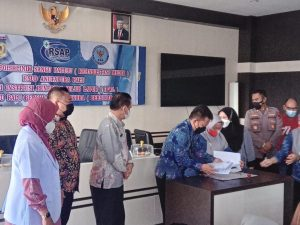

**Palu** - Kepala Kejaksaan Negeri Palu yang diwakili oleh Kepala Seksi Tindak Pidana Umum Bapak A SATYA ADHI CIPTA, S.H., M.H. menghadiri Launching Poliklinik Sangu Patuju sebagai salah satu poliklinik pelayanan rehabilitasi medis bagi penyalahguna narkoba di kota Palu.

Wakil Walikota (Wawali) Kota Palu, dr. Renny Lamadjido, meresmikan Poliklinik tersebut disaksikan Kepala BNNK Kota Palu, AKBP Dr. Baharuddin, Kepala Badan (Kaban) Kesbangpol Kota Palu H. Ansar Sutadi, M.Si,  Sub Koordinator Bidang Rehabilitasi BNNP Sulteng Hj.Roswati, dan Direktur Rumah Sakit Umum Daerah (RSUD) Anutapura, dr. Rosa Da Lima Rupa, di Ruang Administrasi RSUD Anutapura, Jumat (26/08/2022).

 

sumber : [sultengraya.com](https://sultengraya.com/read/139539/wujudkan-kota-palu-bersinar-wawali-kota-palu-launching-poliklinik-sangu-patuju/)
