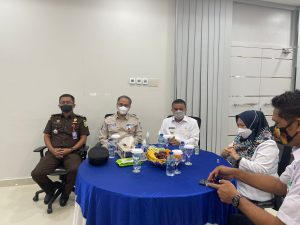

Palu- Kejaksaan Negeri Palu yang di wakilkan oleh Kepala Seksi Pidana Khusus, Bapak Erwin Juma,SH.,MH menghadiri Undangan Launching Revitalisasi Parkir Elektronik (E-Parking) di Kota Palu dengan menggunakan aplikasi Scan Barcode Qris (Quick Response Code Indonesia Standart).

Kegiatan diadakan di Kantor Bank BR cabang Pusat dan dihadiri juga oleh Walikota Palu, Bapak H. Hadianto Rasyid,SE., dan Wakil Walikota Palu, Ibu dr. Reny A. Lamadjido, Sp.PK.,M.Kes
