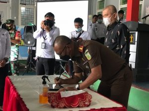

PALU, MERCUSUAR – Lembaga Pembinaan Khusus Anak (LPKA) Kelas II Palu beserta Unit Pelaksana Teknis (UPT) Pemasyarakatan se-Kota Palu, di antaranya Balai Pemasyarakatan (Bapas) Kelas II Palu, Rumah Penyimpanan Barang Sitaan Negara (Rupbasan) Kelas I Palu, Lembaga Pemasyarakatan Perempuan (LPP) Kelas III Palu dan Rumah Tahanan (Rutan) Kelas IIa Palu, melaksanakan Deklarasi Janji Kinerja Tahun 2022.

Kegiatan yang dilaksanakan di Ruang Serbaguna Kantor LPKA Palu ini, dihadiri oleh Kepala Perwakilan Ombudsman RI Sulteng, Sofyan F. Lembah, Kepala Kejaksaan Negeri (Kejari) Kota Palu, Hartawi, Kepala Dinas Pemberdayaan Perempuan dan Perlindungan Anak (DP3A) Kota Palu, Yudhi Riany Firman dan Kepala Bagian Program dan Pelaporan (Kabag PPL) Kanwil Kemenkumham Sulteng, Muh.Said serta Forum Komunikasi Pimpinan Daerah (Forkopimda) Kota Palu.

Kegiatan diawali dengan penandatanganan Perjanjian Kinerja dan komitmen Pembangunan Zona Integritas (ZI) menuju Wilayah Bebas dari Korupsi (WBK) dan Wilayah Birokrasi Bersih dan Melayani (WBBM), antara Kepala Lembaga Pembinaan Khusus Anak (LPKA) Kelas II Palu, Revanda Bangun, dengan para Kepala Seksi (Kasi) Kantor LPKA Palu dan dilanjutkan dengan penandatangan oleh Rutan Kelas II Palu, LPP Kelas III Palu, Bapas Kelas II Palu serta Rupbasan Kelas I Palu.

Setelah itu, dilakukan penandatanganan pencanangan Pembangunan Zona Integritas (ZI) menuju Wilayah Bebas dari Korupsi (WBK) dan Wilayah Birokrasi Bersih dan Melayani (WBBM). Penandatanganan dilakukan Kepala Perwakilan Ombudsman RI Sulteng, serta Kepala Kejaksaan Negeri (Kejari) Palu, sebagai saksi pada kegiatan tersebut.

Selanjutnya, dibacakan janji kinerja yang dipimpin oleh Kepala LPKA Palu dan diikuti oleh seluruh peserta yang hadir. Dalam deklarasi janji kinerja tersebut, seluruh pegawai diminta untuk menjaga kesehatan sehingga dapat berkinerja dengan produktif, melaksanakan perjanjian kinerja dengan profesional dan akuntabel, serta menyiapkan langkah antisipasi dan mitigasi, untuk meminimalisasi risiko.

Setelah dibacakan janji kinerja, Ketua Ombudsman Sulteng turut memberikan sambutan, di mana ia menyampaikan, deklarasi ini merupakan sebuah perjanjian yang harus dikerjakan dengan penuh kerja keras dan penuh keikhlasan.

“Saya ingatkan lagi bahwa sesungguhnya kita ingin terus memperbaiki kinerja kita. Tentunya janji itu harus ditepati dan dipertanggungjawabkan. Tidak hanya itu, ini juga merupakan ajang menuju 6 area perubahan pelayanan publik,” ucapnya.

Lebih lanjutnya, ia menyampaikan suatu kebanggan, dapat melihat kepramukaan dapat menjadi salah satu program pembinaan di LPKA Palu.

“Saya sangat bangga, pembinaan kepramukaan menjadi andalan di sini, di mana dari Pramuka dapat melahirkan pemimpin dunia,” tutupnya.

Selanjutnya, Kepala Kejari Kota Palu, turut memberikan sambutan. Ia menyampaikan, dalam proses kesuksesan meraih predikat WBK, setiap pegawai harus menghindari perbuatan koruptif.

“Pemerintah senantiasa menekankan kita, agar senantiasa berkomitmen agar menghindari perbuatan koruptif. Mudah-mudahan kita semua dapat belajar dari kesalahan sehingga dapat mewujudkan kantor kita meraih predikat WBK tahun ini,” terangnya.

Sebelum kegiatan berakhir, Kepala LPKA Palu turut memberikan sambutan. Ia menuturkan kepada seluruh pegawai Kemenkumham Sulteng, agar senantiasa menjalankan tugas sesuai dengan aturan yang berlaku dan mengindahkan amanat khusus Kepala Kantor Wilayah Kemenkumham Sulawesi Tengah (Kakanwil Kemenkumham Sulteng), terkait pelayanan publik yang bersih.

“Saya sangat bersyukur dapat berada di LPKA Palu. Untuk itu saya berterima kasih atas segala loyalitas yang telah diberikan untuk kantor ini. Melanjutkan penyampaian Ketua Ombudsman, Sesuai perintah Kakanwil, kami dalam tahun ini juga akan memberangkatkan Andikpas untuk ikuti Jambore Nasional, sehingga besar harapan kami para stakeholder dapat memberikan bantuan kepada Andikpas, agar dapat membantu tumbuh kembang mereka semua,” tutupnya.

Setelah sambutan Kepala LPKA Palu, Tim Pramuka Gugus Depan (Gudep) LPKA Palu, menutup kegiatan dengan menampilkan peragaan Semaphore dan membacakan Dasa Dharma Pramuka di hadapan seluruh peserta kegiatan.

sumber : [mercusuar.web.id](https://mercusuar.web.id/kota-palu/lpka-palu-deklarasikan-janji-kinerja-tahun-2022/)
