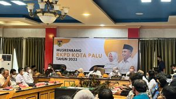

**PALU** - Kepala Kejaksaan Negeri Palu yang diwakili oleh Bapak Sugandhi,SH menghadiri Undangan Pembukaan Kegiatan Musrenbang RKPD Kota Palu Tahun 2023 Bertempat di ruang Rapat Bantaya, Jl Balai Kota Palu, Kelurahan Tanamonindi, Kecamatan Mantikulore, Kota Palu. Rapat berlangsung secara tatap muka dan virtual.

Kegiatan ini dihadiri oleh Wali Kota Palu, Bapak Hadianto Rasyid didampingi Wakil Wali Kota Palu dr. Reny A Lamadjido, dan dihadiri Ketua TP-PKK Kota Palu Diah Puspita, Anggota DPRD Kota Palu Mutmainah Korona, pejabat TNI Polri, para kepala OPD, camat dan lurah serta stakeholder terkait lainnya.

