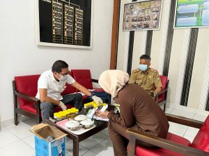
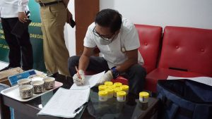

Palu- Tim BNN Kota Palu bersama Tim Dinas Kesehatan Kota Palu, melaksanakan Kegiatan Tes Urine/Skrining terhadap seluruh Pegawai Kejaksaan Negeri Palu.

Kegiatan ini bertujuan untuk Melakukan deteksi dini terhadap indikasi penyalahgunaan dan peredaran gelap narkoba di instansi pemerintah juga sebagai wujud komitmen dari Kejaksaan Negeri Palu terhadap upaya Pencegahan dan Pemberantasan Penyalahgunaan dan Peredaran Gelap Narkoba (P4GN)

