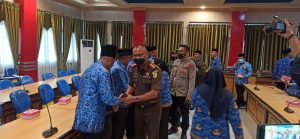

**Palu -** Pemerintah Kota Palu melaksanakan Pelantikan dan Pengambilan sumpah/janji PNS dalam jabatan pimpinan tinggi pratama eselon II b Bertempat di ruang rapat bantaya Jl Balai Kota, Kelurahan Tanamonindi, Kecamatan Mantikulore, Kota Palu, Senin (20/9/2022) pagi

dipimpin oleh Walikota Palu, Bapak Hadianto Rasyid dan dihadiri oleh wakil walikota palu, Ibu dr. Reny A. Lamadjido,Sp. PK.,M.Kes, Kepala Kejaksaan Negeri Palu,dan unsur Forkopimda di Kota Palu
