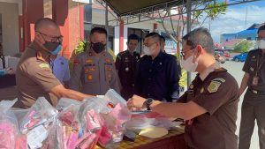
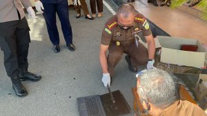

**PALU** - Kejaksaan Negeri Palu memusnahkan barang bukti sabu sebanyak 2,7 kilogram pada hari Kamis, tanggal 19 Mei 2022. Barang Bukti Sabu tersebut merupakan barang bukti dari 138 perkara hasil kejahatan narkotika dan 11 perkara pidana umum lainnya di Kota Palu.

Selain sabu-sabu, turut dimusnahkan barang bukti hasil kejahatan narkotika lainnya, seperti tembakau gorila, tembakau goya, ganja dan obat THD serta hasil kejahatan perkara pidana umum lainnya diantaranya senjata tajam, laptop, Handbody dan obat-obatan berbagai jenis merk dan telepon seluler

Dalam kegiatan pemusnahan barang bukti ini, yang dipimpin langsung Kepala Kejaksaan Negeri Palu, Bapak Hartawi,SH , serta dihadiri oleh Kabagops Polresta Palu, Kompol. Alfian Joan Komaling, SH, Mpd, Perwakilan BNN Kota Palu, AKP. Gusti Bagus Ngurah Parmadi, Perwakilan BPOM Kota Palu, Drs. Passimu, Humas Pengadilan Kota Palu, Bpk. Panji Prastiyawan, SH. MH., Perwakilan Kejari Palu, Bpk. A. Satya Adi, SH., MH.
