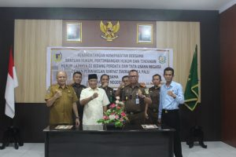

**Palu -** DPRD Kota Palu dan Kejaksaan Negeri Palu melaksanakan Penandatanganan Nota Kesepakatan Bersama (MoU) ditandatangani oleh bapak Moh. Ridwan Karim, S.Sos. M.Si selaku Sekretaris DPRD Kota Palu sebagai Pihak Pertama dan Hartawi, S.H. Kepala Kejaksaan Negeri Palu sebagai Pihak Kedua (Selasa, 11 Januari 2022).

Nota Kesepakatan Bersama antara DPRD Kota Palu dengan Kejaksaan Negeri Palu merupakan kelanjutan dari MOU sebelumnya yang telah berakhir masa berlakunya.

Adapun maksud dan tujuan Perjanjian Kerjasama (MoU) dengan DPRD Kota Palu dimaksudkan untuk mengoptimalkan pelaksanaan tugas dan fungsi Para Pihak dalam penyelesaian masalah Hukum Perdata dan Tata Usaha Negara, dan bertujuan untuk meningkatkan efektifitas penanganan masalah hukum dalam Bidang Perdata dan Tata Usaha Negara baik di dalam maupun di luar Pengadilan.(nov)
