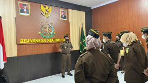
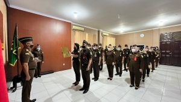

**PALU** - Kepala Kejaksaan Negeri Palu, Bapak Hartawi,SH , memimpin langsung Apel Pencanangan Zona Integritas menuju Wilayah Birokrasi Bersih Melayani (WBBM) dan Wilayah Bebas Korupsi (WBK) yang diikuti oleh seluruh pejabat utama dan pegawai Kejaksaan Negeri Palu.

Kegiatan apel ini merupakan deklarasi/pernyataan dari pimpinan beserta seluruh pegawai unit kerja bahwa Kejaksaan Negeri Palu dan seluruh Pegawai telah siap membangun Zona Integritas.

Apel pencanangan Zona Integritas menuju WBK/WBBM ini juga dilaksanakan secara serentak di seluruh Kejari se Sulteng.
