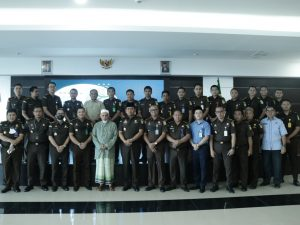

Palu - Seluruh pegawai Kejaksaan Negeri Palu menghadiri acara Pengajian Bersama Kejaksaan Tinggi Sulawesi Tengah yang dihadiri oleh Wakil Kepala Kejaksaan Tinggi Sulawesi Tengah, dan selaku Penceramah Habib Ali Bin Muhammad Idrus Bin Salim Al Djufri.

