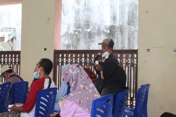
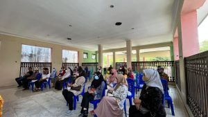

**PALU** - Kejaksaan Negeri Palu bidang Intelijen, mengadakan Penyuluhan / Penerangan Hukum bersama para Mahasiswa KKN Universitas Tadulako berlokasi di Kantor Kelurahan Lolu Utara. Kepala Seksi Bidang Intelijen, Bapak Armadha Tangdibali,SH.,MH sebagai Narasumber dan Dihadiri juga oleh Lurah Lolu Utara, Bapak Christian , dan masyarakat diwilayah kelurahan Lolu Utara.

Tujuan diadakan Penyuluhan / Penerangan Hukum ini, untuk menarik antusias warga terhadap pengetahuan dalam pemahaman hukum , dan memberikan pengetahuan, pemahaman serta meningkatkan kesadaran hukum masyarakat sehingga tercipta masyarakat berhatinurani, berbudaya dan cerdas hukum.

