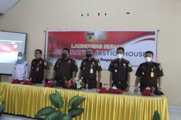

PALU - Kepala Kejaksaan Negeri Palu, Bapak Hartawi,SH didampingi Para Kepala Seksi menyelenggarakan Peresmian Restorative Justice House, bertempat di Kantor Kelurahan Lolu Utara, Rabu (30/03). Dihadiri langsung Oleh Walikota Palu, Bapak Hadianto Rasyid, Kapolres Palu, AKBP Bayu lndra Wiguno,S.I.K.,M.I.K dan dihadiri oleh Forkopinda Kota Palu.

Kepala Kejaksaan Tinggi (Kajati) Sulawesi Tengah Jacob Hendrik Pattipeilohy bersama Gubernur Sulteng Rusdy Mastura meluncurkan secara serentak Rumah Restorative Justice di 10 Kejari dan 14 Cabjari.

Pembentukan Rumah Restorative Justice sebagai implementasi Peraturan Kejaksaan Nomor 15 tahun 2020. Rumah Restorative Justice adalah tempat pelaksanaan musyawarah mufakat dan perdamaian untuk menyelesaikan masalah /perkara pidana yang terjadi dalam masyarakat.

