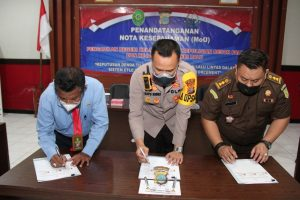

**PALU** – Polres Palu bersama pengadilan dan kejaksaan negeri melakukan penandatanganan nota kesepahaman atau _Memorandum of Understanding_ (MoU) terkait keputusan denda tilang dalam sistem _Electronik Traffic Law Enforcement_ (ETLE) di Aula Rupatama polres setempat, Senin (7/3/2022).

Adapun kegiatan tersebut dibuka oleh Kapolres Palu AKBP Bayu lndra Wiguno, S.I.K.,M.I.K dengan didampingi oleh Wakapolres Palu KOMPOL Yardi Kamril , S.H. Turut hadir, yakni Kasat Lantas Polres Palu AKP Muhammad Nai, Ketua Pengadilan Negeri Palu Dr. Johanis Hehamony ,S.H.,M.H dan staf, Kejaksaan Negeri Palu diwakili oleh Kasipidum A. Satya adhi, S.H., M.H.

Untuk diketahui bahwa, hasil dari kegitan diskusi tersebut adalah :

1. Kesepakatan antara Pengadilan, Kejaksaan dan Kepolisian di wilayah  kota Palu terkait dengan Tabel Denda Tilang Online.
2. Nota Kesepahaman (MoU) antara Polres Palu, Pengadilan Negeri Palu, Kejaksaan Negeri Palu Tentang : Keputusan Denda Tilang Jenis Pelanggaran Lalu Lintas Dalam Sistem Tilang Elektronik yang dikembangkan menjadi ETLE (Eletronik Traffic Law Enforcement).

Source :[rri.co.id](https://rri.co.id/palu/daerah/1379576/kapolres-palu-pengadilan-dan-kejari-palu-teken-mou-penetapan-denda-e-tilang)
