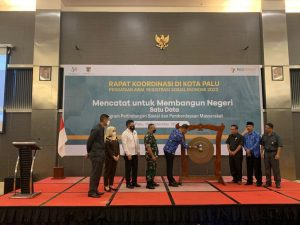

**PALU** - Badan Pusat Statistik (BPS) Kota Palu menggelar Rapat Koordinasi (Rakor) membahas pendataan awal Registrasi Sosial Ekonomi  (Regsosek) di salah satu hotel di Kota Palu, Senin (19/9/2022). Rakor diselenggarakan untuk membahas Regsosek dengan tujuan untuk memantapkan persiapan jelang pendataan Regsosek pada 15 Oktober 2022 dengan melibatkan organisasi perangkat daerah (OPD) di lingkup Pemerintah Kota (Pemkot) Palu terkait hingga camat di Kota Palu pada Rakor tersebut, Regsosek dapat terlaksana dengan baik.

Selain itu, kata dia, berhasilnya Regsosek juga harus didukung masyarakat Kota Palu, dengan cara masyarakat menerima petugas pendata dengan baik dan memberikan data yang benar.

Menurutnya, pentingnya pendataan Regsosek segera dilakukan lantaran masih terbatasnya cakupan data sosial ekonomi penduduk yang ada, untuk dimanfaatkan seluruh program dan layanan kepada masyarakat

Sumber : [sultengraya.com](https://sultengraya.com/read/141270/rakor-bps-palu-bersiap-data-regsosek/)
