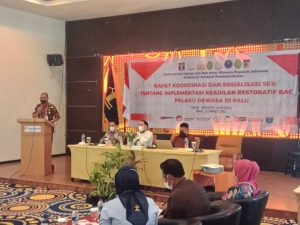

**Palu -** Bertempat di Swiss-Belhotel Silae Kota Palu, Bapas Palu bersama Ditjen Pemasyarakatan menggelar kegiatan Rapat Koordinasi dan Sosialisasi SKB Implementasi Keadilan Restoratif Bagi Pelaku Dewasa di Kota Palu. Kegiatan ini, dihadiri oleh Direktur Bimbingan Kemasyarakatan dan Pengentasan Anak, Direktorat Jenderal Pemasayarakatan Kementerian Hukum dan HAM(Dirjen Bimkemas dan PA) yang diwakili oleh Pembimbing Kemasyarakatan Ahli Madya (Koordinator Litmas dan Pendampingan) pada Direktorat Bimbingan Kemasyarakatan dan Pengentasan Anak (Dharmalingganawati). Acara ini juga dihadiri oleh Analis Kebijakan pada Badan Reserse Kriminal Mabes Polri (Kombes Pol Pitra Ratulangi), Hakim Yustisial pada Biro Hukum & Humas MA RI (Mustamin, SH, MH), Jaksa Fungsional pada Biro Hukum dan Hubungan Luar Negeri Kejaksaan Agung (Dr. Muh. Ibnu Fajar Rahim, SH.,MH) serta Aparat Penegak Hukum (APH) diantaranya Polda Sulawesi Tengah, Kejati Sulawesi Tengah, Pengadilan Tinggi Sulawesi Tengah, Pengadilan Negeri (Palu, Donggala, dan Parigi) Kejaksaan Negeri (Palu, Donggala, dan Parigi) Polresta Palu, Polres Donggala, Polres Parigi, Polres Sigi, Pemkot Kota Palu, serta Lembaga Bantuan Hukum Kota Palu.

