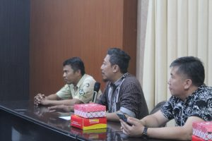
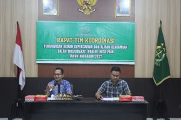

**Palu** - Kegiatan Rapat Koordinasi Pengawasan Aliran Kepercayaan dan Keagamaan (PAKEM) Tahun 2022 di Kantor Kejaksaan Negeri Palu pada hari Jumat tanggal 07 Oktober 2022 mulai pukul 10.15 WITA.

 

Acara dihadiri oleh Kepala Seksi Intelijen Kejaksaan Negeri Palu, Kepala Kesbangpol Kota Palu, Pasi Intel Kodim, Sekretaris Dinas Pendidikan dan Kebudayaan Kota Palu , Kasat Intelkam, Kementerian Agama Kota Palu, Forum Kerukunan Umat Beragama (FKUB) Kota Palu, BIN Kota Palu

 Acara dibuka oleh Kepala Kejaksaan Negeri Palu, Bapak I NYOMAN PURYA, S.H,. M.H selaku Ketua Tim Koordinasi Pengawasan Aliran Kepercayaan dan Aliran Keagamaan Dalam Masyarakat (PAKEM) Kejaksaan Negeri Palu. Dalam penyampaiannya, Kegiatan PAKEM bertujuan mengawasi dan deteksi dini terhadap aliran-aliran kepercayaan dan aliran-aliran keagamaan yang ada di masyarakat yang terindikasi menimbulkan keresahan di masyarakat dan membahayakan Negara serta berpotensi menodai agama yang diakui di Negara Kesatuan Republik Indonesia. Kegiatan Pakem merupakan wadah untuk sharing tentang aliran kepercayaan dan aliran keagamaan khususnya yang ada di wilayah hukum Kejaksaan Negeri Palu
