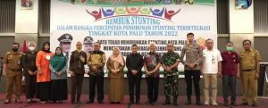

Palu - Kejaksaan Negeri Palu yang diwakili oleh Staf bidang Tindak Pidana Umum menghadiri kegiatan "REMBUK STUNTING", Wali Kota Palu, H. Hadianto Rasyid, SE didampingi Wakil Wali Kota Palu, dr. Reny A. Lamadjido, Sp.PK.,M.Kes secara resmi membuka Rembuk Stunting pada Selasa, 05 Juli 2022 di Hotel Best Western Coco Palu.

Dengan mengangkat Tema "Satu tekad Menurunkan Stunting Kota Palu Menciptakan Generasi Zillenial yang cerdas dan Berkarakter" Kegiatan tersebut dilaksanakan dalam rangka percepatan penurunan stunting terintegrasi tingkat Kota Palu tahun 2022.

 

Sumber: Bagian PROKOPIM Setda Kota Palu
