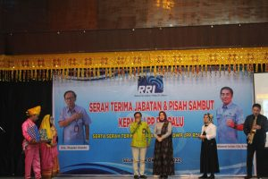
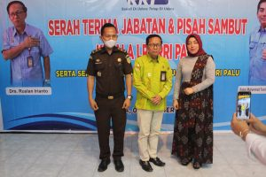

Palu - Acara serah terima jabatan Kepala RRI Palu dari Ruslan Irianto yang telah memasuki masa purna bakti kepada Raden Muhammad Yusridarto, disaksikan Direktur Program dan Produksi LPP RRI Mistam, serta dihadiri sejumlah pejabat instansi vertikal dan daerah serta para angkasawan RRI Palu, Sulawesi Tengah (Sulteng), selasa (04/10/22)

Mistam juga menegaskan bahwa tugas LPP RRI adalah mengawal konstitusi NKRI, UUD 1945 dan Pancasila, serta segala produk hukum, termasuk produk hukum dan identitas daerah. Ia menitipkan pesan kepada pejabat Kepala LPP RRI Palu agar selain membangun kolaborasi dan inovasi dengan berbagai pihak di Sulawesi Tengah, juga perlu membangun orkestrasi di lingkup internal, sehingga karyawan RRI bisa memiliki hubungan, masa depan yang lebih dan bertanggung jawab.

pada kesempatan ini, Kejaksaan Negeri Palu diwakili oleh Kepala Seksi Intelijen Kejaksaan Negeri Palu, Bapak I Nyoman Purya, S.H.,M.H,
