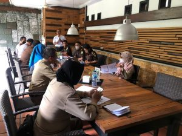

Palu - Tim JPN Kejaksaan Negeri Palu bersama BPJS Kesehatan Cabang Kota Palu melaksanakan Forum Koordinasi Pengawasan dan Pemeriksaan Kepatuhan Tahap I Kota Palu pada hari Senin, 27 Juni 2022

Kegiatan tersebut dihadiri juga oleh Perwakilan dari Satlantas Polres Palu, Dinas Tenaga Kerja Sulawesi Tengah, Dinas Koperasi UMKM dan Tenaga Kerja Kota Palu, Dinas Penanaman Modal dan Pelayanan Terpadu Satu Pintu, dalam rangka tercapainya komunikasi yang baik dengan para pihak pemangku kepentingan dalam pelaksanaan pengawasan, pemeriksaan dan penegakkan hukum terkait pelaksanaan program BPJS Kesehatan di Era Jaminan Kesehatan Nasional (JKN) saat ini.
