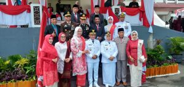

Palu - Kepala Kejaksaan Negeri Palu menghadiri Upacara Pengibaran Bendera Merah Putih memperingati HUT ke-77 Republik Indonesia yang diselenggarakan Pemkot Palu pada Rabu, 17 Agustus 2022, di halaman kantor Wali Kota Palu.

Upacara yang dimulai sekitar pukul 09.00 WITA tersebut dipimpin langsung oleh Wali Kota Palu, Hadianto Rasyid, yang juga dihadiri Wakil Wali Kota Palu, Reny A. Lamadjido, Sekretaris Daerah Kota Palu, Irmayanti Pettalolo, unsur Forkopimda Kota Palu, dan lainnya, semakin semarak dengan diawali sejumlah penampilan drum band dan musik bambu dari beberapa TK dan SD di bawah naungan Dinas Pendidikan dan Kebudayaan Kota Palu.

sumber : [Kumparan.com](https://kumparan.com/paluposo/hut-ke-77-republik-indonesia-di-palu-berlangsung-khidmat-1yg8VRpJnAY/full)
