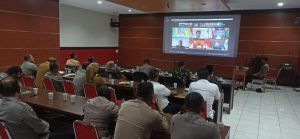

**Palu -** Kepala Kejaksaan Negeri Palu menghadiri undangan dari Polresta Kota Palu yang membahas Antisipasi dampak kenaikan Harga BBM secara virtual di Ruang Rupatama Polresta Kota Palu dan dihadiri oleh seluruh jajaran, Senin (05/9/2022)

dikatakan bahwa ada beberapa upaya dalam perumusan antisipasi inflasi daerah dari dampak kenaikan BBM itu di antaranya dengan pengendalian kemampuan daya beli masyarakat. Pemkot Palu juga tengah menyiapkan pengendalian dengan ketentuan terkini yaitu mengelola kembali APBD untuk disiapkan sebagai pengurangan beban masyarakat. diharapkan masyarakat tetap tenang dan tidak _panic buying_ menyikapi kenaikan harga BBM ini, karena pemerintah telah memperhitungkan semuanya.
