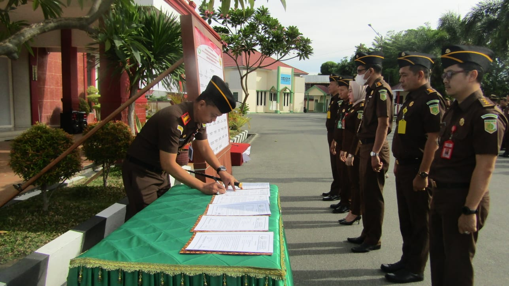

**PALU** – Kejaksaaan Negeri Palu melaksanakan Pencanangan pembangunan zona integritas (ZI) Wilayah Bebas dari Korupsi (WBK) dan Wilayah Birokrasi Bersih dan Melayani (WBBM). Hal itu disampaikan oleh Kepala Kejaksaan Negeri (Kajari) Kota Palu, Muhammad Irwan Datuiding, dalam apel pencanangan ZI menuju WBK dan WBBM, Jumat (5/5).

"Pembangunan ZI menuju WBK dan WBBM merupakan miniatur penerapan reformasi birokrasi di beberapa unit kerja yang bertujuan untuk membangun program reformasi birokrasi sehingga diharapkan mengedepankan budaya kerja yang anti korupsi, berkinerja tinggi dan memberikan pelayanan publik yang berkualitas", tegas Kajari Palu dalam apel yang digelar di halaman kantor Kejari Palu.

Dalam sambutannya, Kajari Palu menegaskan bahwa dalam mewujudkan ZI menuju WBK dan WBBM, bukanlah pekerjaan mudah sehingga dibutuhkan partisipasi semua pihak mulai dari pucuk pimpinan sampai pada bawahan, dan harus memiliki komitmen yang kuat, _mind set_ dan _culture set_ yang sama sehingga keberhasilan ZI dapat dicapai. Adapun sasaran yang ingin dicapai dalam zona integritas yaitu terwujudnya pemerintah yang bebas dan bersih dari Korupsi, Kolusi dan Nepotisme (KKN) serta meningkatnya kualitas pelayanan publik, tegas Kajari Palu.

Bahwa pencanangan ZI menuju WBK dan WBBM merupakan langkah awal dan bagian dari mensukseskan reformasi birokrasi dengan melakukan penataan terhadap sistem penyelenggaraan pemerintahan yang baik efektif, evesian dan pelayanan prima melalui enam area perubahan yaitu, manajemen perubahan, penataan tata laksana, penataan manajemen sumber daya manusia, penguatan akuntabilitas, penguatan pengawasan dan terakhir peningkatan kualitas pelayanan publik. (tim redaksi)
