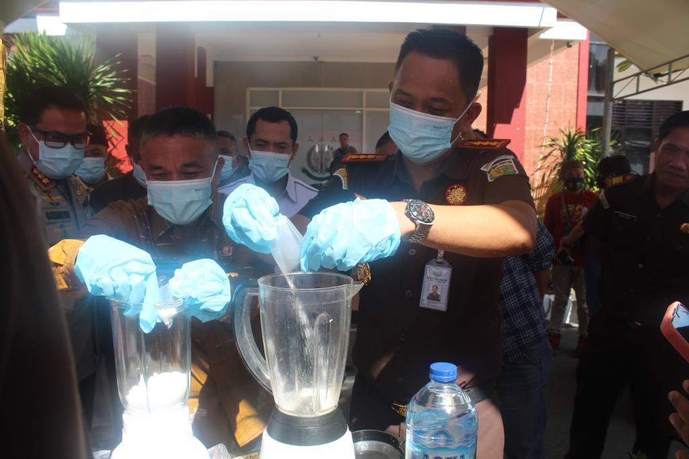

**Palu -** Kejaksaan Negeri Palu melaksanakan pemusnahan barang bukti atas perkara yang memiliki putusan yang berkekuatan hukum tetap, berdasarkan putusan Pengadilan Negeri Palu dan Surat Perintah Kejaksaan Negeri Palu nomor: Print- 660/P.2.10/enz.3/05/2023 tanggal 09 Mei 2023. Pemusnahan barang bukti dilakukan pada hari Kamis tanggal 11 Mei 2023 di halaman kantor Kejaksaan Negeri Palu.

\[caption id="attachment\_1495" align="aligncenter" width="1024"\] Kejari Palu bersama unsur Forkopimda Kota Palu melakukan pemusnahan barang bukti sabu-sabu\[/caption\]

Pemusnahan barang bukti ini dilakukan dengan disaksikan oleh Kepala Kejaksaan Negeri Palu, Walikota Palu, Ketua DPRD Kota Palu, Ketua Pengadilan Negeri Palu, Dandim 1306 Kota Palu, Kepala Kepolisian Resor Palu, Kepala BNN Kota Palu, Kepala BPOM Kota Palu serta para jaksa di lingkungan Kejati Sulteng dan Kejari Palu.

Pemusnahan barang bukti terdiri dari 50 perkara sebagai berikut:

1. tindak pidana narkotika sebanyak 42 perkara dengan barang bukti shabu ± 840,47 gram, thd sebanyak 45 butir dan ganja seberat 4790,9823 gram.
2. tindak pidana pembunuhan 1 perkara dengan barang bukti badik. -
3. tindak pidana pencurian 3 perkara dengan barang bukti 2 badik 1 obeng dan tang. - tindak pidana penganiayaan 1 perkara dengan barang bukti parang.
4. tindak pidana perlindungaan anak 1 perkara dengan barang bukti 2 handphone dan dokumen.
5. tindak pidana perjudian 2 perkara 3 handphone lembar kertas rekapan nomor / shio; atm dll
6. tindak pidana perlindungan konsumen 1 perkara dengan barang bukti 4 (empat) unit dispenser pengisian bahan bakar minyak yang bertuliskan pom mini sulsel (pms) warna merah putih; 4 (empat) buah manual book v.21.03d, pom mini sulsel n50-h, assymeter-aichi-flow hitam kcc full dispenser controller.
7. tindak pidana perikanan 1 perkara dengan barang bukti 6 (enam) buah botol bahan peledak atau bom ikan,6 (enam) buah dopis,1 (satu) pasang sepatu katak,1 (satu) buah kaca mata selam,1 (satu) gulung obat nyamuk ,1 (satu) buah korek api gas,1 (satu) buah gabus. 5. pemusnahan barang bukti ini akan dilakukan dengan cara diblender, digurinda, dibakar, dan dihancurkan hingga tidak dapat dipergunakan lagi.

(tim redaksi)
