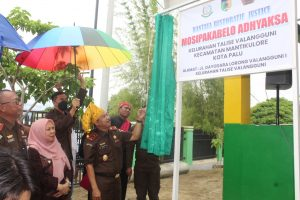
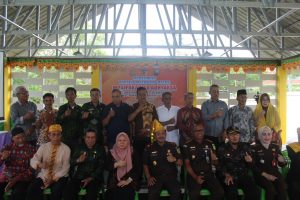

Palu - Pemerintah Kota Palu bersama Kejaksaan Tinggi Sulawesi Tengah dan Kejaksaan Negeri Palu meresmikan Bantaya Restorative Justice Mosipakabelo Adhyaksa Kelurahan Talise Valangguni, Kecamatan Mantikulore, Kamis (26/1/2023)

Kata **Mosipakabelo** diambil dari tagline Kecamatan Mantikulore dengan arti bersama-sama saling memperbaiki. Diharapkan Bantaya ini akan difungsikan sebagai tempat pelaksanaan Musyawarah Mufakat dan perdamaian untuk menyelesaikan perkara pidana ringan yang terjadi dimasyarakat.

 

Hadir pada peresmian Bantaya Restorative Justice Mosipakabelo Adhyaksa antara lain Wakil Walikota Palu dr.Reny A Lamadjido, Kajati Sulteng, Kajari Palu, Lurah Talise Valangguni, Camat Mantikulore, tokoh Adat dan Masyarakat.

Bantaya Restorative Justice Mosipakabelo Adhyaksa berlokasi di samping Kantor Kelurahan Jalan Dayodara Lorong Valangguni, Kecamatan Mantikulore, Kota Palu, Sulawesi Tengah

 

sumber : [Tribunpalu.com](https://palu.tribunnews.com/2023/01/26/pemkot-palu-dan-kejati-sulteng-resmikan-bantaya-restorative-justice-mosipakabelo-adhyaksa.)
